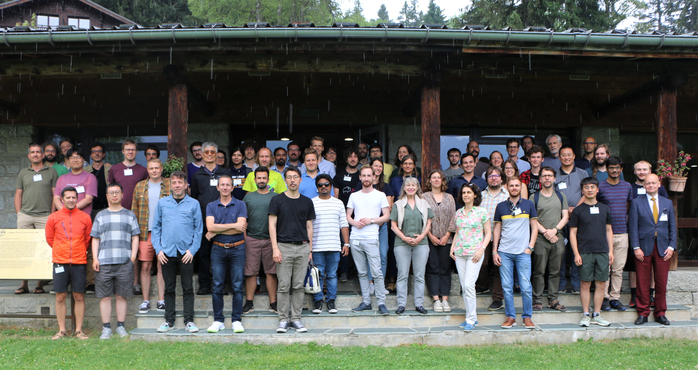

* Lecture as part of "low-energy school" at [Les Houches](https://www.houches-school-physics.com/en/), 21 -- 30 June, 2023, École de physique des Houches, France

  <!--  -->
  
    

        <i>Les Houches, 2023</i>
    
  

