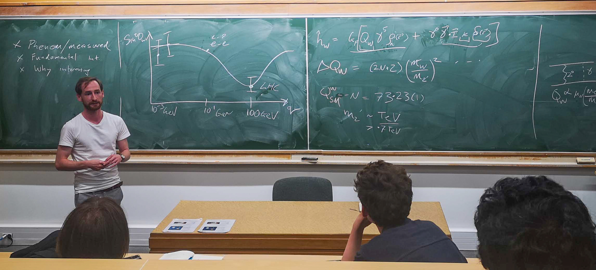

Research in theoretical atomic physics and particle astrophysics. My work focusses on high-precision atomic structure calculations, and how atomic processes can be used for testing fundamental theories, probing for physics beyond the standard model, and searching for dark matter.

  
    

        <i>Les Houches, 2023</i>
    
  

### Available projects at UQ (PhD, masters, honours, and undergraduate)

* [Atomic physics as a probe of the Standard Model at low energies](https://smp.uq.edu.au/project/atomic-physics-probe-standard-model)
* [Development of high-precision atomic structure methods](https://smp.uq.edu.au/project/development-high-accuracy-atomic-theory-methods)
* [Theoretical characterisation of systems for the development of atomic clocks](https://smp.uq.edu.au/project/theoretical-characterisation-systems-development-atomic-clocks)
* [Enlightening the search for dark matter (and other exotic physics)](https://smp.uq.edu.au/project/enlightening-search-dark-matter-and-other-exotic-physics)
* For more details, see: [researchers.uq.edu.au/researcher/24237](https://researchers.uq.edu.au/researcher/24237)
* Projects are flexible and other projects are available, contact me with any questions
* Formal applications are made through the University of Queensland -- [smp.uq.edu.au/study/higher-degree-research](https://smp.uq.edu.au/study/higher-degree-research). Feel free to contact me directly with any questions

### Links

* ORCiD: [orcid.org/0000-0002-0345-6375](https://orcid.org/0000-0002-0345-6375)
* arXiv profile (all papers, free downloads): [arxiv.org/a/roberts_b_1](https://arxiv.org/a/roberts_b_1.html)
* [Google Scholar profile](https://scholar.google.com.au/citations?user=5i5bTuwAAAAJ)
* [InspireHEP: B.M.Roberts.1](http://inspirehep.net/author/profile/B.M.Roberts.1)
* [ADS publications page](https://ui.adsabs.harvard.edu/public-libraries/vWzKbWxgTBqzF8vVh78nAQ)
* [UQ page](https://researchers.uq.edu.au/researcher/24237)
* [Brief CV (pdf)]({{ site.baseurl }}/docs/cv-RobertsBM.pdf)
* [Full publications list (pdf)]({{ site.baseurl }}/docs/publications-RobertsBM.pdf)
  * [Publications with abstracts]({{ site.baseurl }}/docs/publications-Abstracts-RobertsBM.pdf)
* [Recent slides/presentations]({{ site.baseurl }}/slides)

<!-- Slides from most of my recent conference presentations can be found [here]({{ site.baseurl }}/talks) -->

## Recent publications

 
 <article class="post">

   <h1><a href="{{ site.baseurl }}{{ pub.url }}">{{ pub.title }}</a></h1>
   

     {{ pub.excerpt }}
      
   

 </article>
 
